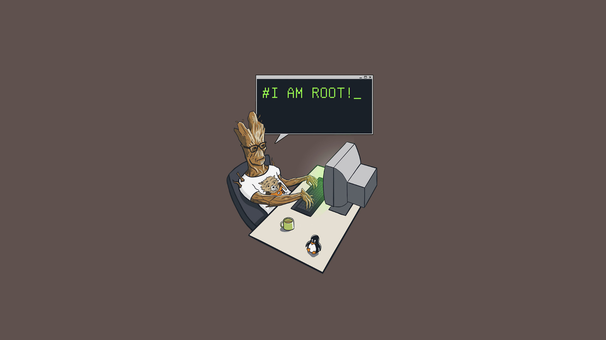

  

<h3 align="center">A passionate web developer from Colombia</h3>

👋I am Juan Avila, a passionate Backend Developer focused on Node.js, Express, and JavaScript, with experience in databases like MongoDB and MySQL. My goal is to create robust and efficient solutions for the digital world.🌟

When I'm not immersed in lines of code, I find inspiration in poetry, philosophy, and psychology, exploring the depths of words and ideas. Additionally, I am a enthusiast of gastronomy 🍔 and music 🎶, and in my free time, the dance floor is my sanctuary. 💃

Thank you for visiting my profile and joining me on my technological and creative journey! 🚀🎉

<h2 align="center">Connect with me:</h2>

<h3 align="center">Languages and Tecnologies</h3>

 
   
   
   
   
   
   
  
   
   
  
  
  
  
  
  
  
  

 

<h2 align="center">GitHub Stats:</h2>

 

 

<picture style="jutify">
  <source media="(prefers-color-scheme: dark)" srcset="https://raw.githubusercontent.com/JuanDavidAvilaRaveloCampus/JuanDavidAvilaRaveloCampus/output/github-contribution-grid-snake-dark.svg">
  
</picture>  
  
    
  
  
  

